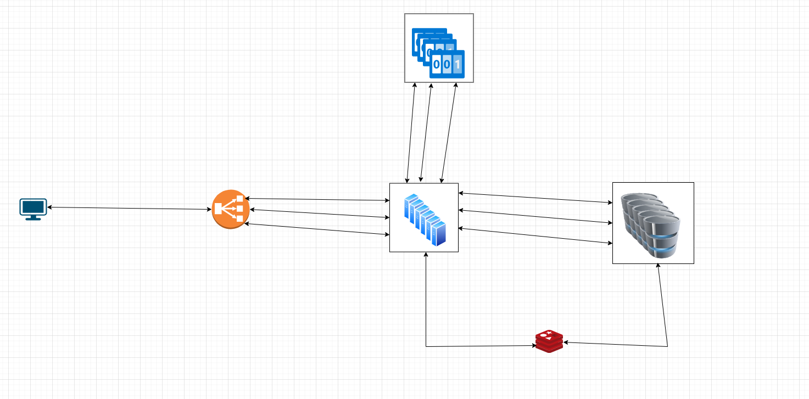

# Link Shortener App

This is a Link Shortener app implemented using FastAPI and MongoDB.

## Functionality

The functionality is simple:

- Users can send a long URL.
- The app returns a code.
- When users send a request to that code, they get redirected to the given URL.

Additionally, the app includes JWT authentication.

# Non-functional aspects

- **High Availability**: Our system must ensure high availability to allow users to access their links at any time without interruption.
- **Efficiency in Link Shortening**: Our links must be efficiently shortened while maintaining readability for users.
- **Scalability**: Our system should be designed to scale horizontally to accommodate the potentially unlimited number of links to be stored.

## Implementation and Usage

To implement and use this app:

1. Clone the repository.
2. Install the required dependencies (`fastapi`, `uvicorn`, `pymongo`, `python-jose`).
3. Create .env file and add these data to it ['SECRET_KEY','ALGORITHM','ACCESS_TOKEN_EXPIRE_MINUTES','MONGODB_SERVER_IP']
3. Run the FastAPI server (`uvicorn main:app --reload`).

## Choice of Components

### MongoDB

I decided to use MongoDB because:

1. We have more reads than writes (likely around a 50:1 ratio).
2. We don't have complicated relationships, and we only have two main databases, as shown in the picture above.
3. We don't require complicated queries.
4. It's highly scalable and can be a good choice if we want to scale horizontally.

### FastAPI

There were multiple choices, but I chose FastAPI for the following reasons:

1. FastAPI is fast, as the name suggests.
2. It's a good choice if we want to scale the app further.
3. It's simple, and we can use async functionality.
4. On the other hand, Django was also a good choice (because I was comfortable developing code in Django), but it had too many options that we didn't need.

### JWT Authentication

The main choice for JWT Authentication was because we don't store user data in the database in this situation (although we need a database to store logged-out users, but it can be a small database), and it was easy to implement and provides good security.

## Design Architecture

Currently, this is our architecture:

## Improvements and Scalability

Our app is not scalable at the moment, but we can add some functionality to make it scalable. One of the most important parts is that currently, we have a Single Point of Failure (SPOF). If our server goes down, we can't do anything, so what should we do?

We can create multiple instances of our server. Also, we need to create a service for authentication and a service for URL shortening. When we need to create multiple instances of our server, we obviously need a load balancer.

Currently, I'm generating random IDs with a length of 5 for shortened links, but it's not the best solution because when our app scales, we might have millions of data. Each time we create a new ID, we have to look up in the database and ensure it doesn't belong to other links. The best way to implement this is to get a number between 11,630,847,988 and 675,184,552,117, convert it to base58, and then we have a unique ID.

You may ask why we should use these numbers? We are forced to have a 5-digit code for the link shortener, and these numbers and all the numbers in between create 5-digit codes. Another question might be, why base58? Because base58 is more readable and removes some lookalike characters.

Again, we shouldn't have a single point of failure, so we need some instances of these numbers, and we need ZooKeeper to assign numbers to servers (we create a range for each server, and ZooKeeper handles what server has what ranges and gives new ranges to new servers).

Also, we need a caching mechanism, and we need multiple instances of the database (we can store data based on what alphabet they start with).

In addition we can add rate limiters for preventing too much load on our servers

## What to Add Next?

There are many threats to our system, such as:
1. DDoS attacks: We can prevent them by implementing measures like CAPTCHA or restricting IPs that send a lot of requests.
2. Circular redirects: We should prevent the scenario where a link provided causes our app to have circular redirects.